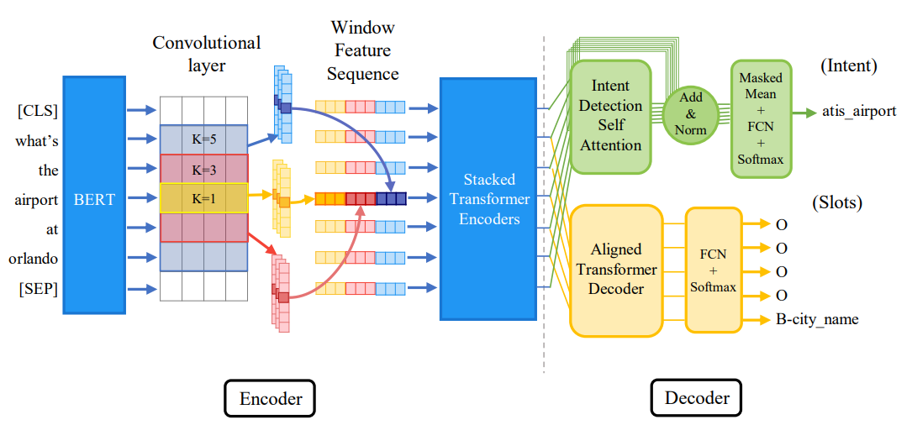

# Using CTran models for Vietnamese Slot Filling and Intent Detection Tasks

### Tasks

  Slot Filling and Intent Detection in Vietnamese dataset. This problem is taken from Vietnamese Intent Detection and Slot Tagging BKAI NAVER challenge. We can see more detailed information about the contest in [here](https://aihub.ml/competitions/207).

  #### Dataset Overview 

  Training Dataset: 1790 

  Dev Dataset: 378

  Example of Dataset: 

    Text: em có biết kích hoạt màu sắc của quạt trần không

    IntentLabel: smart.home.set.color

    SlotFilling: O O O B-commandcommand I-commandcommand O O O B-devicedevice I-devicedevice O

  Unique Labels in Intent Labels: 

    smart.home.decrease.level
    smart.home.set.percentage
    smart.home.decrease.percentage
    smart.home.set.color
    greeting
    smart.home.set.level
    smart.home.device.onoff
    smart.home.increase.percentage
    smart.home.increase.level
    smart.home.check.status

  Unique Labels in Slot Labels: 

    O
    B-statusstatus
    B-floornumberfloornumber
    I-statusstatus
    B-sysnumbersysnumber
    B-roomroom
    B-final-valuesysnumber
    B-change-valuesyspercentage
    B-devicedevice
    I-roomroom
    I-commandcommand
    B-final-valuesyspercentage
    I-final-valuesyspercentage
    I-colorcolor
    B-allall
    B-change-valuesysnumber
    I-floornumberfloornumber
    I-devicedevice
    B-commandcommand
    B-colorcolor
    I-change-valuesyspercentage

### Models _ CTran 

In fact, in this problem I saw that there were many models tested and used in the competition, teams used and tested SOTA models at that time, so now I am aiming for a recently announced SOTA model. That model is CTran.

Model overview: CTan is a encoder-decoder model, combining CNNs with Transformers and define the concept of alignment in Transformer decoder for the first time. The encoder is shared between the two intent detection and slot filling tasks, hence the model benefits from implied dependency of two tasks. In CTRAN's shared encoder, BERT is used as word embedding. What follows is the convolutional operation on word embeddings, which is then accompanied by the "window feature sequence" structure, essentially transposing the output to a certain shape instead of using pooling operations. We decided on using a stack of Transformer encoders to create a new contextualized representation of the input which also considers the new embedding generated by the CNN. The decoder comprises self-attention and a linear layer to produce output probabilities for intent detection. Furthermore, we propose the novel Aligned Transformer decoder, followed by a fully connected layer for the slot filling task.

In details, you can flow this [link](https://github.com/rafiepour/CTran).

### Dependencies 

  I use python 3.8.18 for implement this model for this dataset: 

    numpy==1.23.5
    scikit_learn==1.2.2
    torch==1.13.0
    tqdm==4.64.1
    transformers==4.25.1
    tqdm
    sacremoses
    scikit-learn
    sacremoses
    subword_nmt
    hydra-core==1.0.7
    fastBPE
    sentencepiece
    importlib-metadata
    pandas
    matplolib

### Some approach to optimize model 

- [x] Using another vocab (Add from dev_test)
- [x] Using another version of PhoBert for Tokenizer and Encoder Task (Using phobert_base, phobert_base_v2, phobert_large)
- [x] Preprocessing in Vietnamese Text (Text Normalization, Remove Duplicate Character)
- [x] Using Label Smoothing 
- [x] Test different coefficients for the loss function

### Results 

The results are taken from the dev set

| Model | Slot Filling F1 Score | Intent Detection PR Score | Note |
|-------|-----------------------|---------------------------|------|
| CTran | 0.87 | 0.80 | Just using model and not having preprocessing in dataset|
| CTran (PreProcessing in dataset) | 0.88 | 0.82 | Using PreProcessing in dataset |
| Ctran (Adding more word in vocab dictionary) | 0.9168 | 0.875 | Get vocab from train and dev test |
| Ctran (Using phobert_v2) | 0.91 | 0.86 | Phobert_base_v2, vocab full, Text Preprocessing |
| CTran (Vocab in Train) | 0.90 | 0.85 | Phobert_base, Vocab in Train, Text Preprocessing |
| Ctran (Modify Loss) | 0.87 | 0.86 | Add 0.5 * in loss 1 |
| Ctran (Modify Loss) | 0.9361 | 0.863 | Add 0.5 * in loss 2 |
| Ctran (Modify Loss) | 0.9301 | 0.8293 | Add 1.25 * in loss 2 |
| Ctran (label Smoothing) | 0.9259 | 0.8636 | Add 1.25 * in loss 2 and label smoothing |
| Ctran (label Smoothing) | 0.9508 | 0.8774 | Label Smoothing and do not change anything in loss |
| Ctran (weight decay) | 0.9297 | 0.8363 | Using Weight Decay with Label Smoothing|

### Models Weights

You can run CTran_BKAIData.inpynb to get the weights. 

